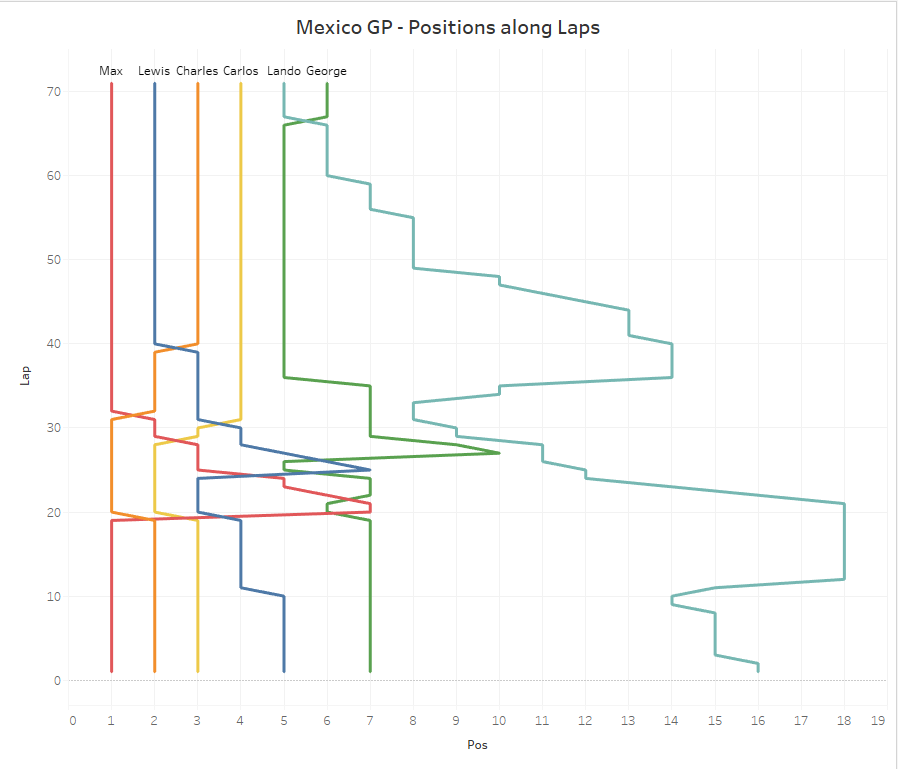
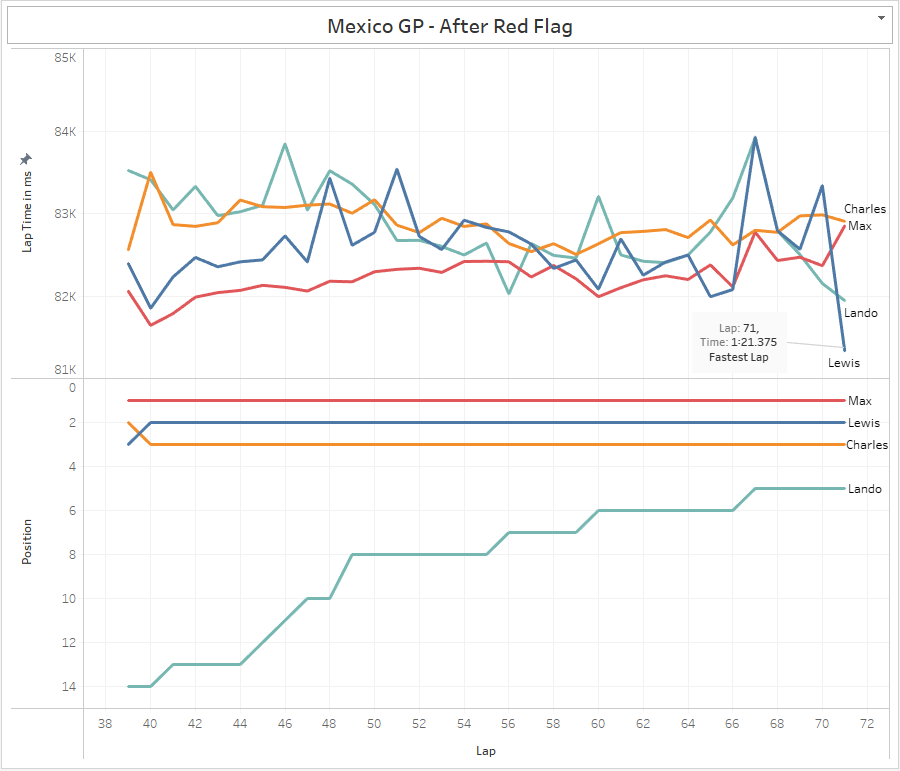

# Formula 1 Data Collection and Conversion

This repository contains Python scripts to collect Formula 1 (F1) data from the Ergast Developer API and convert it into a more usable format. The data includes lap timings and qualifying results for the year 2023.

## Files

1. **main.py**: This script collects lap timings data for the F1 season in 2023. It requests data from the Ergast API, parses it, and saves it as a JSON file.

2. **utils.py**: Contains a utility function to convert lap times from a string format to milliseconds.

3. **get_quali_data.py**: Collects F1 qualifying results for the 2023 season, including Q1, Q2, and Q3 times for each driver. The data is requested from the Ergast API and saved as a JSON file.

4. **get_lap_timings.py**: Provides a function for extracting lap timings data from the BeautifulSoup-parsed results. The data is organized into a nested dictionary.

5. **convert_json_to_csv.py**: Converts the collected data into CSV format for further analysis and visualization. Two functions are included: `quali()` and `laps()`, which convert qualifying and lap timing data, respectively.

## Usage

1. Make sure you have the required dependencies installed, including `requests`, `BeautifulSoup`, `lxml`, and `json`.

2. Run `main.py` to collect and save lap timings data.

3. Run `get_quali_data.py` to collect and save qualifying results data.

4. Use the `convert_json_to_csv.py` script to convert the data into CSV format. Uncomment and modify the `quali()` or `laps()` function as needed to convert the specific data you want.

5. The converted CSV files will be saved in the `data/output` directory.

6. You can further analyze, visualize, or manipulate the data as per your requirements.

## Folder Structure

- `data`: Contains the directory structure where the collected data is saved.
  - `laps`: Lap timings data for different rounds.
  - `quali`: Qualifying results data.
  - `output`: The converted CSV files.

Please note that this README provides an overview of the scripts and their purpose. Make sure to review and modify the code to fit your specific needs and ensure that you have the required Python environment set up.